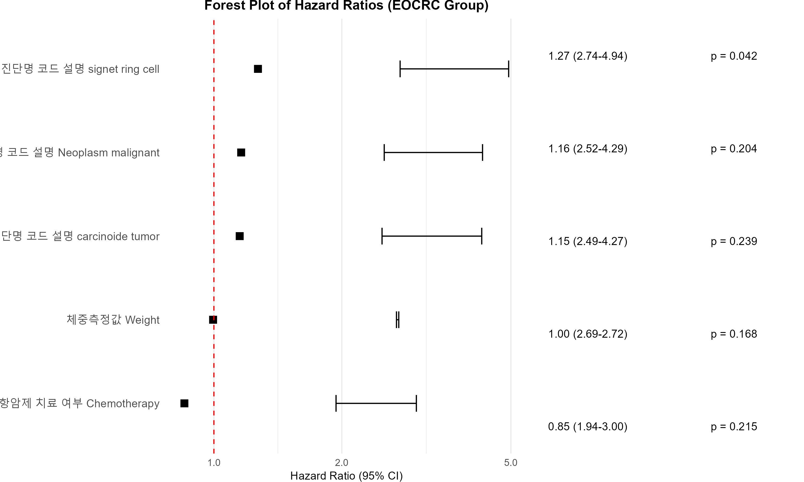
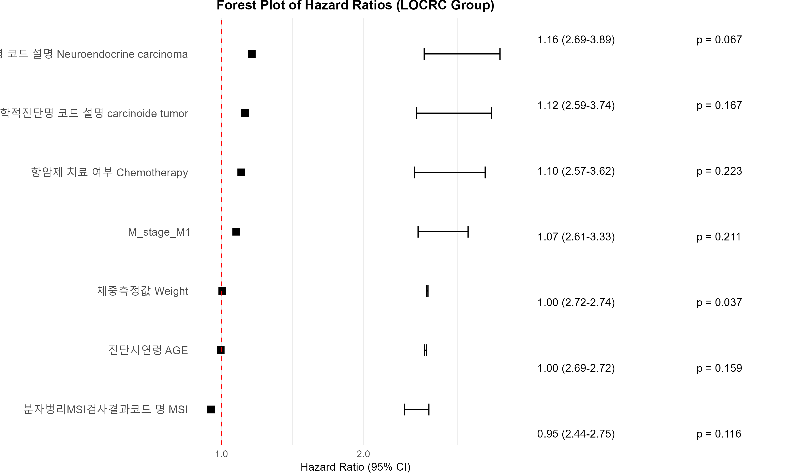

# 상관관계 분석
- EDA 분석을 실행하기 위해 일반 02_exploratory_analysis.R 파일을 실행한다.
- 해당 파일에서 일단 파일의 이름을 정확하게 알아야 하기에 아래 코드를 출력한다.
```R
cat("\n=== 데이터 기본 정보 ===\n")
cat("데이터 차원:", dim(data), "\n")
cat("변수명:\n")
print(names(data))
```
- 주요 분석 방법은 임상 변수들 간의 상관관계 분석, 병기와 생존의 관련성 분석, 수술 여부와 생존의 관련성 분석 
- 결과로만 따지면 이렇다 할만한 연관성을 찾기가 힘들었음 
## 임상 변수들 간의 상관관계 분석
- 연령,신장게측,생존 여부에 관해 상관관계 분석을 했을 때, 모두 상관관계가 거의 없음을 확인할 수 있었다. 
    - 추가로 찾아보니 애초에 정말 상관관계가 없다고 알려져 있음

## 병기와 생존의 관련성 분석
- 병기와 생존의 관련성 분석을 했을 때, p-value < 0.05에 해당 하는 값이 전혀 없음을 확인함

## 수술 여부와 생존의 관련성 분석
- 수술 여부와 생존의 관련성 분석을 했을 때, p-value < 0.05에 해당 하는 값이 전혀 없음을 확인함

## 생존 분석
- 생존 분석을 했을 때, p-value < 0.05에 해당 하는 값이 전혀 없음을 확인함


# 처음부터
- 데이터 전처리의 문제라 생각하여 처음부터 다시 하기로 했다. 기존 SEER데이터셋을 사용한 한국의 논문이 있기에 참고할 수 있었다.
- [논문](https://www.nature.com/articles/s41598-025-95385-0)
- 논문에서 50세 이전 암진단 환자의 경우 EOCRC로 분류하고, 50세 이후 암진단 환자의 경우 LOCRC로 분류했다.
- 해당 데이터셋의 비율은 3:7로 EOCRC와 LOCRC로 분류한다. 논문에서도 같다.
- 이후 확인해보니 논문에서는 18세 이상 환자만을 대상으로 분석했다. 이전에는 결측치만 제외하고 분석했다.
- 추가적으로 확인하니 모든 요소가 0이거나 1인 변수 검사를 해보니 모두 0인 변수 4개, [1] "병기STAGE.N2a." "병기STAGE.N2b." "병기STAGE.N3a." "병기STAGE.N3b." 가 있어 모두 삭제하기로함, 1은 없었음
- EOCRC와 LOCRC로 분류한 데이터를 학습 데이터와 테스트 데이터로 분리하여 저장 


## 대장암 임상 데이터 변수 정리
|변수명|설명|값 예시/코드|
|---|---|---|
|AGE|진단 시 연령|67|
|조직학적 진단명 (mucinous 등)|각 조직형별 진단 여부|0=아니오, 1=예|
|병기(STAGE) 정보 (Tis, T1 등)|각 병기별 진단 여부|0=아니오, 1=예|
|Type.of.Drink|음주 종류|1=맥주, 2=소주, 3=양주, 99=기타|
|Smoke|흡연 여부|0=비흡연, 1=현재흡연, 2=과거흡연|
|Height|신장(cm)|170.1|
|Weight|체중(kg)|64.5|
|EGFR|면역병리 EGFR 검사 결과|1=negative, 2=positive, 99=해당없음|
|MSI, KRASMUTATION_EXON2, KRASMUTATION, NRASMUTATION, BRAF_MUTATION|분자병리 검사 결과|1=not detected, 2=detected, 99=해당없음|
|Operation|대장암 수술 여부|0=아니오, 1=예|
|Chemotherapy|항암제 치료 여부|0=아니오, 1=예|
|Radiation.Therapy|방사선 치료 여부|0=아니오, 1=예|
|Death|사망 여부|0=아니오, 1=예|
|Survival.period|암 진단 후 생존 일수|267 (days)|
|cancer_type|암 유형(EOCRC, LOCRC)|"EOCRC", "LOCRC"|

## 줄이기
- 데이터셋 변수 줄이기로는 병기를 통합하는 방법 밖엔 없음 논문에서는 TMN으로 줄였지만 우리는 T,M,N으로 줄이리고함
- 결측치 50퍼 넘어가는건 삭제하려 했으나 M_stage가 날아가는것이 문제임, M_stage만 남길지 고민임
    - 국제 표준으로 병기 부분은 남기는게 옳다함 M도 날아가고 N도 날아가게 생겼으니 병기 부분은 예외로 두는게 옳음
## 단변량 분석
- 각 임상 변수와 생존(사망여부와 생존기간)과의 상관 관계를 확인하기 위해 단변량 분석을 수행한다.
- 관련성 적은 변수는 모두 삭제할것


### 단변량 분석 결과
- 값이 쓰레기 처럼 나왔다. 
1. M_stage의 값이 M1과 NA로 표시되는데 이것을 하나의 병리값이 나오는것으로 판단한다
2. N_stage도 똑같다
3. 생각없이 99를 NA로 바꿨다 데이터를 다시 뜯어보니 결론이 났다.
    - 분자병리 검사 → 99를 NA(결측치)로 처리 (MSI, KRASMUTATION, NRASMUTATION, BRAF_MUTATION)
    - 이유:
        - 이들은 선택적 검사로 모든 환자에게 시행되지 않음
        - 99="해당없음"은 실제로 검사를 시행하지 않음을 의미
        - 검사 미시행과 음성/양성 결과는 완전히 다른 정보
        - 논문에서도 분자병리 마커는 중요한 예후 인자로 사용되므로 정확한 처리 필요
4. 99를 모두 0으로 바꾸려고보니 음주 부분은 0으로 바꿔도 문제가 없을것 같았지만 나머지가 문제였다.
- 논문 기반으로 진행하는 것이라 논문 기중에 맞추고 NA로 바꾸고 다중대치법 적용함함

## 단변량 분석 결과
```
===  EOCRC 그룹 단변량 Cox 회귀 분석 ===

[전체 변수 분석 결과]


              Variable                                                             HR   CI_lower   CI_upper   p_value
------------  --------------------------------------------------------------  -------  ---------  ---------  --------
lower .952    조직학적진단명.코드.설명.signet.ring.cell.                        1.284      1.021      1.614     0.033
lower .957    조직학적진단명.코드.설명.Neoplasm.malignant.                      1.184      0.943      1.485     0.145
lower .9511   체중측정값.Weight.                                                0.995      0.989      1.002     0.152
lower .954    조직학적진단명.코드.설명.carcinoide.tumor.                        1.165      0.924      1.470     0.197
lower .9519   항암제.치료.여부.Chemotherapy.                                    0.849      0.660      1.092     0.202
lower .953    조직학적진단명.코드.설명.adenocarcinoma.                          0.882      0.711      1.094     0.253
lower .958    음주종류.Type.of.Drink.                                           1.045      0.968      1.127     0.262
lower .9512   면역병리EGFR검사코드.명.EGFR.                                     0.915      0.775      1.081     0.297
lower .9517   분자병리BRAF_MUTATION검사결과코드.명.BRAF_MUTATION.               0.935      0.789      1.107     0.434
lower .9523   M_stage                                                           0.937      0.793      1.107     0.442
lower .951    조직학적진단명.코드.설명.mucinous.                                1.092      0.870      1.369     0.449
lower .9515   분자병리KRASMUTATION검사결과코드.명.KRASMUTATION.                 0.948      0.803      1.120     0.531
lower .9518   대장암.수술.여부.Operation.                                       0.945      0.781      1.143     0.560
lower .956    조직학적진단명.코드.설명.squamous.cell.carcinoma.                 1.061      0.829      1.357     0.638
lower .9510   신장값.Height.                                                    1.002      0.994      1.009     0.650
lower .9514   분자병리KRASMUTATION_EXON2검사결과코드.명.KRASMUTATION_EXON2.     1.034      0.875      1.222     0.692
lower .959    흡연여부.Smoke.                                                   1.016      0.905      1.142     0.783
lower .9516   분자병리NRASMUTATION검사결과코드.명.NRASMUTATION.                 1.019      0.863      1.204     0.824
lower .9522   N_stage                                                          -0.151      0.809      1.168     0.860
lower .9520   방사선치료.여부.Radiation.Therapy.                                1.015      0.805      1.281     0.899
lower .955    조직학적진단명.코드.설명.Neuroendocrine.carcinoma.                1.012      0.789      1.298     0.927
lower .9513   분자병리MSI검사결과코드.명.MSI.                                   0.997      0.909      1.094     0.951
lower .95     진단시연령.AGE.                                                   1.000      0.990      1.011     0.954
lower .9521   T_stage                                                           0.032      0.819      1.316     1.038

[유의미한 변수 (p < 0.05)]


             Variable                                         HR   CI_lower   CI_upper   p_value
-----------  -------------------------------------------  ------  ---------  ---------  --------
lower .952   조직학적진단명.코드.설명.signet.ring.cell.    1.284      1.021      1.614     0.033

유의미한 범주형 변수에 대한 생존곡선을 그립니다...
> # LOCRC 그룹 분석
> locrc_results <- perform_univariate_analysis(locrc_data, "LOCRC")

===  LOCRC 그룹 단변량 Cox 회귀 분석 ===

[전체 변수 분석 결과]


              Variable                                                            HR   CI_lower   CI_upper   p_value
------------  --------------------------------------------------------------  ------  ---------  ---------  --------
lower .9511   체중측정값.Weight.                                               1.004      1.000      1.008     0.045
lower .955    조직학적진단명.코드.설명.Neuroendocrine.carcinoma.               1.156      0.986      1.354     0.074
lower .9513   분자병리MSI검사결과코드.명.MSI.                                  0.952      0.893      1.013     0.122
lower .954    조직학적진단명.코드.설명.carcinoide.tumor.                       1.128      0.960      1.327     0.144
lower .95     진단시연령.AGE.                                                  0.996      0.991      1.001     0.156
lower .9523   M_stage                                                          1.085      0.969      1.215     0.157
lower .9519   항암제.치료.여부.Chemotherapy.                                   1.100      0.942      1.286     0.228
lower .9518   대장암.수술.여부.Operation.                                      0.928      0.815      1.055     0.254
lower .958    음주종류.Type.of.Drink.                                          1.030      0.977      1.086     0.272
lower .9510   신장값.Height.                                                   1.003      0.998      1.008     0.275
lower .9516   분자병리NRASMUTATION검사결과코드.명.NRASMUTATION.                1.057      0.944      1.183     0.337
lower .9517   분자병리BRAF_MUTATION검사결과코드.명.BRAF_MUTATION.              1.039      0.928      1.165     0.506
lower .953    조직학적진단명.코드.설명.adenocarcinoma.                         1.052      0.900      1.231     0.524
lower .9514   분자병리KRASMUTATION_EXON2검사결과코드.명.KRASMUTATION_EXON2.    0.967      0.864      1.083     0.566
lower .9520   방사선치료.여부.Radiation.Therapy.                               1.042      0.890      1.220     0.608
lower .959    흡연여부.Smoke.                                                  1.020      0.941      1.105     0.632
lower .9512   면역병리EGFR검사코드.명.EGFR.                                    0.974      0.870      1.090     0.641
lower .9515   분자병리KRASMUTATION검사결과코드.명.KRASMUTATION.                1.025      0.916      1.147     0.667
lower .956    조직학적진단명.코드.설명.squamous.cell.carcinoma.                1.029      0.870      1.217     0.740
lower .952    조직학적진단명.코드.설명.signet.ring.cell.                       0.976      0.828      1.150     0.771
lower .957    조직학적진단명.코드.설명.Neoplasm.malignant.                     1.016      0.861      1.200     0.847
lower .951    조직학적진단명.코드.설명.mucinous.                               1.015      0.867      1.189     0.851
lower .9521   T_stage                                                          0.009      0.766      1.059     0.901
lower .9522   N_stage                                                          0.080      0.940      1.211     1.083

[유의미한 변수 (p < 0.05)]


              Variable                 HR   CI_lower   CI_upper   p_value
------------  -------------------  ------  ---------  ---------  --------
lower .9511   체중측정값.Weight.    1.004          1      1.008     0.045

```
- 우리나라 대장암의 발병률 양상과 위험인자에 대한 연구 라는 이름의 [우리나라 대장암의 발병률 양상과
위험인자에 대한 연구](https://repository.nhimc.or.kr/bitstream/2023.oak/208/2/2017-20-004.pdf) 
    - "앞서 분석한 단변량 분석결과에서 대장암 발생에 유의한 요인으로 선정된 변수들과 기존문헌에서 조사된 요인들을 모두 혼합하여 다변량 분석을 실시하였다." 를 기준으로 진행하겠다.

- 일단은 다변량도 시도해보겠다

## 다변량 분석
- 단변량 분석은 ```surv(생존일수 ,사망여부) ~ 하나의 변수``` 이런식으로 해결됐다면
- 다변량은 ```surv(생존일수 ,사망여부) ~ 여러개의 변수``` 이런식으로 해결된다
```
 [1] "순번.No."
 [2] "진단시연령.AGE."
 [3] "조직학적진단명.코드.설명.mucinous."
 [4] "조직학적진단명.코드.설명.signet.ring.cell."
 [5] "조직학적진단명.코드.설명.adenocarcinoma."
 [6] "조직학적진단명.코드.설명.carcinoide.tumor."
 [7] "조직학적진단명.코드.설명.Neuroendocrine.carcinoma."
 [8] "조직학적진단명.코드.설명.squamous.cell.carcinoma."
 [9] "조직학적진단명.코드.설명.Neoplasm.malignant."
[10] "음주종류.Type.of.Drink."
[11] "흡연여부.Smoke."
[12] "신장값.Height."
[13] "체중측정값.Weight."
[14] "면역병리EGFR검사코드.명.EGFR."
[15] "분자병리MSI검사결과코드.명.MSI."
[16] "분자병리KRASMUTATION_EXON2검사결과코드.명.KRASMUTATION_EXON2."
[17] "분자병리KRASMUTATION검사결과코드.명.KRASMUTATION."
[18] "분자병리NRASMUTATION검사결과코드.명.NRASMUTATION."
[19] "분자병리BRAF_MUTATION검사결과코드.명.BRAF_MUTATION."
[20] "대장암.수술.여부.Operation."
[21] "항암제.치료.여부.Chemotherapy."
[22] "방사선치료.여부.Radiation.Therapy."
[23] "사망여부.Death."
[24] "암진단후생존일수.Survival.period."
[25] "T_stage"
[26] "N_stage"
[27] "M_stage"
[28] "cancer_type"
```
- 다변량에서 제외할 변수는 순번, cancer_type 이다. 2개 빠짐
- 진단명도 필요하다 생각함, 단변량에서 유의미한 변수였음, EOCRC에서는 유일하게 p < 0.05를 만족하는 변수였고, LOCRC에서는 아쉽게도 만족하지 못한 변수였다. 외국의 사레에서는 보수적으로 P < 0.25까지 포함한다고 친다면 (현재 프로젝트의 데이터 수의 부족이므로)
- EOCRC에서는 
```
lower .952    조직학적진단명.코드.설명.signet.ring.cell.                        1.284      1.021      1.614     0.033
lower .957    조직학적진단명.코드.설명.Neoplasm.malignant.                      1.184      0.943      1.485     0.145
lower .9511   체중측정값.Weight.                                                0.995      0.989      1.002     0.152
lower .954    조직학적진단명.코드.설명.carcinoide.tumor.                        1.165      0.924      1.470     0.197
lower .9519   항암제.치료.여부.Chemotherapy.                                    0.849      0.660      1.092     0.202
```
- 가 해당될 것이고
- LOCRC에서는 
```
              Variable                                                            HR   CI_lower   CI_upper   p_value
------------  --------------------------------------------------------------  ------  ---------  ---------  --------
lower .9511   체중측정값.Weight.                                               1.004      1.000      1.008     0.045
lower .955    조직학적진단명.코드.설명.Neuroendocrine.carcinoma.               1.156      0.986      1.354     0.074
lower .9513   분자병리MSI검사결과코드.명.MSI.                                  0.952      0.893      1.013     0.122
lower .954    조직학적진단명.코드.설명.carcinoide.tumor.                       1.128      0.960      1.327     0.144
lower .95     진단시연령.AGE.                                                  0.996      0.991      1.001     0.156
lower .9523   M_stage                                                          1.085      0.969      1.215     0.157
lower .9519   항암제.치료.여부.Chemotherapy.                                   1.100      0.942      1.286     0.228
```
- 일것이다.

- 다변량 분석을 시행해 p < 0.25 로 다시 진행할지, 아님 독립 예후인자로 뽑을지 결정해보자

### 다변량 분석 결과
```
[다변량 분석 결과]


                                                                Variable                                                            HR   CI_lower   CI_upper   p_value
--------------------------------------------------------------  --------------------------------------------------------------  ------  ---------  ---------  --------
조직학적진단명.코드.설명.signet.ring.cell.                      조직학적진단명.코드.설명.signet.ring.cell.                       1.294      2.793      5.109     0.029
체중측정값.Weight.                                              체중측정값.Weight.                                               0.995      2.687      2.721     0.107
항암제.치료.여부.Chemotherapy.                                  항암제.치료.여부.Chemotherapy.                                   0.842      1.922      2.960     0.184
조직학적진단명.코드.설명.carcinoide.tumor.                      조직학적진단명.코드.설명.carcinoide.tumor.                       1.160      2.504      4.333     0.214
음주종류.Type.of.Drink.                                         음주종류.Type.of.Drink.                                          1.048      2.638      3.101     0.234
조직학적진단명.코드.설명.Neoplasm.malignant.                    조직학적진단명.코드.설명.Neoplasm.malignant.                     1.149      2.493      4.244     0.235
N_stageN2                                                       N_stageN2                                                        0.854      1.917      3.066     0.255
면역병리EGFR검사코드.명.EGFR.                                   면역병리EGFR검사코드.명.EGFR.                                    0.907      2.127      2.977     0.301
조직학적진단명.코드.설명.adenocarcinoma.                        조직학적진단명.코드.설명.adenocarcinoma.                         0.892      2.050      3.031     0.304
분자병리BRAF_MUTATION검사결과코드.명.BRAF_MUTATION.             분자병리BRAF_MUTATION검사결과코드.명.BRAF_MUTATION.              0.915      2.153      2.982     0.328
T_stageTis                                                      T_stageTis                                                       1.132      2.367      4.427     0.374
분자병리KRASMUTATION검사결과코드.명.KRASMUTATION.               분자병리KRASMUTATION검사결과코드.명.KRASMUTATION.                0.930      2.184      3.024     0.411
M_stageM1                                                       M_stageM1                                                        0.937      2.208      3.031     0.449
조직학적진단명.코드.설명.squamous.cell.carcinoma.               조직학적진단명.코드.설명.squamous.cell.carcinoma.                1.088      2.336      4.038     0.506
대장암.수술.여부.Operation.                                     대장암.수술.여부.Operation.                                      0.938      2.168      3.119     0.517
T_stageT2                                                       T_stageT2                                                        1.072      2.323      3.905     0.572
T_stageT4                                                       T_stageT4                                                        0.925      2.013      3.399     0.586
조직학적진단명.코드.설명.mucinous.                              조직학적진단명.코드.설명.mucinous.                               1.063      2.327      3.810     0.603
분자병리NRASMUTATION검사결과코드.명.NRASMUTATION.               분자병리NRASMUTATION검사결과코드.명.NRASMUTATION.                1.045      2.414      3.450     0.615
N_stageN1                                                       N_stageN1                                                        0.970      2.239      3.215     0.750
신장값.Height.                                                  신장값.Height.                                                   1.001      2.701      2.743     0.754
N_stageN3                                                       N_stageN3                                                        0.938      1.878      4.045     0.754
진단시연령.AGE.                                                 진단시연령.AGE.                                                  1.002      2.694      2.752     0.769
분자병리KRASMUTATION_EXON2검사결과코드.명.KRASMUTATION_EXON2.   분자병리KRASMUTATION_EXON2검사결과코드.명.KRASMUTATION_EXON2.    1.024      2.364      3.383     0.790
T_stageT3                                                       T_stageT3                                                        1.025      2.223      3.729     0.844
흡연여부.Smoke.                                                 흡연여부.Smoke.                                                  1.007      2.449      3.104     0.902
조직학적진단명.코드.설명.Neuroendocrine.carcinoma.              조직학적진단명.코드.설명.Neuroendocrine.carcinoma.               1.007      2.190      3.651     0.954
방사선치료.여부.Radiation.Therapy.                              방사선치료.여부.Radiation.Therapy.                               0.999      2.204      3.533     0.992
분자병리MSI검사결과코드.명.MSI.                                 분자병리MSI검사결과코드.명.MSI.                                  1.000      2.470      3.020     0.994

[유의미한 변수 (p < 0.05)]


                                             Variable                                         HR   CI_lower   CI_upper   p_value
-------------------------------------------  -------------------------------------------  ------  ---------  ---------  --------
조직학적진단명.코드.설명.signet.ring.cell.   조직학적진단명.코드.설명.signet.ring.cell.    1.294      2.793      5.109     0.029

[모델 적합도 검정 (Likelihood ratio test)]
Analysis of Deviance Table
 Cox model: response is Surv(암진단후생존일수.Survival.period., 사망여부.Death.)
Terms added sequentially (first to last)

                                            loglik  Chisq Df Pr(>|Chi|)
NULL                                       -3929.4
조직학적진단명.코드.설명.signet.ring.cell. -3927.2 4.3116  1    0.03785 *
---
Signif. codes:  0 '***' 0.001 '**' 0.01 '*' 0.05 '.' 0.1 ' ' 1

[모델의 Harrell's C-index] 0.514
> # LOCRC 그룹 다변량 분석
> locrc_mv_results <- perform_multivariate_analysis(locrc_data, "LOCRC")

===  LOCRC 그룹 다변량 Cox 회귀 분석 ===

[다변량 분석 결과]


                                                                Variable                                                            HR   CI_lower   CI_upper   p_value
--------------------------------------------------------------  --------------------------------------------------------------  ------  ---------  ---------  --------
체중측정값.Weight.                                              체중측정값.Weight.                                               1.004      2.719      2.740     0.043
조직학적진단명.코드.설명.Neuroendocrine.carcinoma.              조직학적진단명.코드.설명.Neuroendocrine.carcinoma.               1.167      2.705      3.931     0.057
분자병리MSI검사결과코드.명.MSI.                                 분자병리MSI검사결과코드.명.MSI.                                  0.936      2.398      2.724     0.058
T_stageT4                                                       T_stageT4                                                        0.853      2.031      2.791     0.092
진단시연령.AGE.                                                 진단시연령.AGE.                                                  0.996      2.694      2.722     0.162
T_stageT2                                                       T_stageT2                                                        0.891      2.132      2.851     0.162
조직학적진단명.코드.설명.carcinoide.tumor.                      조직학적진단명.코드.설명.carcinoide.tumor.                       1.113      2.576      3.707     0.196
항암제.치료.여부.Chemotherapy.                                  항암제.치료.여부.Chemotherapy.                                   1.109      2.581      3.655     0.197
M_stageM1                                                       M_stageM1                                                        1.073      2.606      3.326     0.225
음주종류.Type.of.Drink.                                         음주종류.Type.of.Drink.                                          1.031      2.659      2.968     0.256
신장값.Height.                                                  신장값.Height.                                                   1.003      2.712      2.741     0.264
분자병리BRAF_MUTATION검사결과코드.명.BRAF_MUTATION.             분자병리BRAF_MUTATION검사결과코드.명.BRAF_MUTATION.              1.065      2.575      3.318     0.297
면역병리EGFR검사코드.명.EGFR.                                   면역병리EGFR검사코드.명.EGFR.                                    0.941      2.301      2.893     0.325
대장암.수술.여부.Operation.                                     대장암.수술.여부.Operation.                                      0.938      2.278      2.908     0.330
N_stageN1                                                       N_stageN1                                                        1.063      2.550      3.345     0.346
분자병리NRASMUTATION검사결과코드.명.NRASMUTATION.               분자병리NRASMUTATION검사결과코드.명.NRASMUTATION.                1.050      2.550      3.250     0.404
조직학적진단명.코드.설명.adenocarcinoma.                        조직학적진단명.코드.설명.adenocarcinoma.                         1.067      2.488      3.487     0.421
분자병리KRASMUTATION_EXON2검사결과코드.명.KRASMUTATION_EXON2.   분자병리KRASMUTATION_EXON2검사결과코드.명.KRASMUTATION_EXON2.    0.962      2.355      2.943     0.507
N_stageN2                                                       N_stageN2                                                        1.063      2.429      3.572     0.507
방사선치료.여부.Radiation.Therapy.                              방사선치료.여부.Radiation.Therapy.                               1.044      2.438      3.400     0.591
T_stageTis                                                      T_stageTis                                                       0.954      2.205      3.165     0.627
조직학적진단명.코드.설명.squamous.cell.carcinoma.               조직학적진단명.코드.설명.squamous.cell.carcinoma.                1.035      2.398      3.403     0.689
조직학적진단명.코드.설명.mucinous.                              조직학적진단명.코드.설명.mucinous.                               1.025      2.397      3.326     0.760
흡연여부.Smoke.                                                 흡연여부.Smoke.                                                  1.012      2.544      2.996     0.770
조직학적진단명.코드.설명.signet.ring.cell.                      조직학적진단명.코드.설명.signet.ring.cell.                       0.980      2.295      3.175     0.807
조직학적진단명.코드.설명.Neoplasm.malignant.                    조직학적진단명.코드.설명.Neoplasm.malignant.                     1.007      2.344      3.287     0.936
N_stageN3                                                       N_stageN3                                                        0.998      2.133      3.729     0.991
T_stageT3                                                       T_stageT3                                                        0.999      2.332      3.251     0.993
분자병리KRASMUTATION검사결과코드.명.KRASMUTATION.               분자병리KRASMUTATION검사결과코드.명.KRASMUTATION.                1.000      2.432      3.082     0.996

[유의미한 변수 (p < 0.05)]


                     Variable                 HR   CI_lower   CI_upper   p_value
-------------------  -------------------  ------  ---------  ---------  --------
체중측정값.Weight.   체중측정값.Weight.    1.004      2.719       2.74     0.043

[모델 적합도 검정 (Likelihood ratio test)]
Analysis of Deviance Table
 Cox model: response is Surv(암진단후생존일수.Survival.period., 사망여부.Death.)
Terms added sequentially (first to last)

                    loglik  Chisq Df Pr(>|Chi|)
NULL               -9530.3
체중측정값.Weight. -9528.3 3.9845  1    0.04592 *
---
Signif. codes:  0 '***' 0.001 '**' 0.01 '*' 0.05 '.' 0.1 ' ' 1

[모델의 Harrell's C-index] 0.519 
> # 다중공선성 검사 함수 (VIF 계산)
> check_multicollinearity <- function(model) {
+   if (require(car)) {
+     vif_values <- car::vif(model)
+     return(vif_values)
+   } else {
+     install.packages("car")
+     library(car)
+     vif_values <- car::vif(model)
+     return(vif_values)
+   }
+ }
> # EOCRC 모델에 대한 다중공선성 검사 (유의한 변수가 있는 경우)
> if (!is.null(eocrc_mv_results)) {
+   cat("\n=== EOCRC 모델 다중공선성 검사 (VIF) ===\n")
+   tryCatch({
+     vif_eocrc <- check_multicollinearity(eocrc_mv_results$significant_model)
+     print(vif_eocrc)
+   }, error = function(e) {
+     cat("다중공선성 검사 중 오류:", conditionMessage(e), "\n")
+   })
+ }

=== EOCRC 모델 다중공선성 검사 (VIF) ===
Loading required package: car
Loading required package: carData

Attaching package: 'car'

The following object is masked from 'package:purrr':

    some

The following object is masked from 'package:dplyr':

    recode

다중공선성 검사 중 오류: model contains fewer than 2 terms
Warning message:
In vif.default(model) : No intercept: vifs may not be sensible.
> # LOCRC 모델에 대한 다중공선성 검사 (유의한 변수가 있는 경우)
> if (!is.null(locrc_mv_results)) {
+   cat("\n=== LOCRC 모델 다중공선성 검사 (VIF) ===\n")
+   tryCatch({
+     vif_locrc <- check_multicollinearity(locrc_mv_results$significant_model)
+     print(vif_locrc)
+   }, error = function(e) {
+     cat("다중공선성 검사 중 오류:", conditionMessage(e), "\n")
+   })
+ }

=== LOCRC 모델 다중공선성 검사 (VIF) ===
다중공선성 검사 중 오류: model contains fewer than 2 terms 
Warning message:
In vif.default(model) : No intercept: vifs may not be sensible.
```
- 이번에도 유의미한 변수를 찾는것에 실패했다
- 실패요인은 아무래도 데이터 수가 적은 것이 문제가 아닐지 싶다. 
- 논문의 방법을 너무 답습한것도 문제가 아닐까 싶다.

#### EOCRC의 train 데이터셋 다변량 분석 결과
```
조직학적진단명.코드.설명.signet.ring.cell.
HR(위험비): 1.294
95% CI: (2.793, 5.109)
p-value: 0.029
```
- 위 단 한개의 변수만이 유의미함
- 모델 적합도 검정 
    - Likelihood ratio test: p = 0.038 
        - 모델 자체는 통계적으로 유의미함
    - Harrell's C-index: 0.514 
        - 해석: 예측력이 거의 무작위(0.5)와 비슷함. (논문에서는 0.88 수준)
- 다중공산성 검사 유의미한 변수가 1개 뿐이라 다중공산성 자체 평가가 불가함

#### LOCRC의 train 데이터셋 다변량 분석 결과
```
[다변량 분석 결과]
체중측정값.Weight.
HR: 1.004
95% CI: (2.719, 2.74)
p-value: 0.043
```
- 모델 적합도 검정
    - Likelihood ratio test: p = 0.046 
        - 모델 자체는 통계적으로 유의
    - Harrell's C-index: 0.519
        - 예측력이 무작위(0.5)와 거의 동일
- 다중공선성 검사(VIF)
    - 유의미한 변수가 1개뿐이어서 다중공선성 평가 불가

##### 결론
- 일단 논문 분석 수준으로 끌어올리기에는 실패한것 같다.
    - 데이터 부족도 하나의 문제가 될거 같고, 변수가 모자란것도 문제가 된다고 본다.
    - p-value가 0.25를 고려할 때가 된것 같다.

## 단변량 p-value < 0.25
### EOCRC
              Variable                                           HR   CI_lower   CI_upper   p_value
------------  ---------------------------------------------  ------  ---------  ---------  --------
lower .952    조직학적진단명.코드.설명.signet.ring.cell.      1.284      1.021      1.614     0.033
lower .957    조직학적진단명.코드.설명.Neoplasm.malignant.    1.184      0.943      1.485     0.145
lower .9511   체중측정값.Weight.                              0.995      0.989      1.002     0.152
lower .954    조직학적진단명.코드.설명.carcinoide.tumor.      1.165      0.924      1.470     0.197
lower .9519   항암제.치료.여부.Chemotherapy.                  0.849      0.660      1.092     0.202

### LOCRC
              Variable                                                 HR   CI_lower   CI_upper   p_value
------------  ---------------------------------------------------  ------  ---------  ---------  --------
lower .9511   체중측정값.Weight.                                    1.004      1.000      1.008     0.045
lower .955    조직학적진단명.코드.설명.Neuroendocrine.carcinoma.    1.156      0.986      1.354     0.074
lower .9513   분자병리MSI검사결과코드.명.MSI.                       0.952      0.893      1.013     0.122
lower .954    조직학적진단명.코드.설명.carcinoide.tumor.            1.128      0.960      1.327     0.144
lower .95     진단시연령.AGE.                                       0.996      0.991      1.001     0.156
lower .9523   M_stage                                               1.085      0.969      1.215     0.157
lower .9519   항암제.치료.여부.Chemotherapy.                        1.100      0.942      1.286     0.228

## 다변량 p-value < 0.25
- 살펴보다보니 M_stageM1                                            M_stageM1                                             1.075      2.611      3.332     0.211 
    - 이런식으로 M_stage가 M_stageM1로 변환됨 
    - 단변량에선 surv_fit을 써서 내부적으로 처리시켰고, 다변량은 coxph를 썼다. 즉 coxph는 회귀 모델이기에 자동으로 더미 변수를 생성로 변환한다는 뜻이다. 근데 왜 M_Stage만 유독 이럴까?
        - 바로 병기 부분은 M0, M1으로 이루어져 있기 때문이다. 
### EOCRC
```
===  EOCRC 그룹 다변량 Cox 회귀 분석 (p < 0.25 유의변수 기반) ===

[다변량 분석 결과]


                                               Variable                                           HR   CI_lower   CI_upper   p_value
---------------------------------------------  ---------------------------------------------  ------  ---------  ---------  --------
조직학적진단명.코드.설명.signet.ring.cell.     조직학적진단명.코드.설명.signet.ring.cell.      1.270      2.743      4.940     0.042
체중측정값.Weight.                             체중측정값.Weight.                              0.996      2.690      2.723     0.168
조직학적진단명.코드.설명.Neoplasm.malignant.   조직학적진단명.코드.설명.Neoplasm.malignant.    1.159      2.517      4.288     0.204
항암제.치료.여부.Chemotherapy.                 항암제.치료.여부.Chemotherapy.                  0.852      1.938      2.996     0.215
조직학적진단명.코드.설명.carcinoide.tumor.     조직학적진단명.코드.설명.carcinoide.tumor.      1.150      2.487      4.269     0.239

[유의미한 변수 (p < 0.25)]


                                               Variable                                           HR   CI_lower   CI_upper   p_value
---------------------------------------------  ---------------------------------------------  ------  ---------  ---------  --------
조직학적진단명.코드.설명.signet.ring.cell.     조직학적진단명.코드.설명.signet.ring.cell.      1.270      2.743      4.940     0.042
체중측정값.Weight.                             체중측정값.Weight.                              0.996      2.690      2.723     0.168
조직학적진단명.코드.설명.Neoplasm.malignant.   조직학적진단명.코드.설명.Neoplasm.malignant.    1.159      2.517      4.288     0.204
항암제.치료.여부.Chemotherapy.                 항암제.치료.여부.Chemotherapy.                  0.852      1.938      2.996     0.215
조직학적진단명.코드.설명.carcinoide.tumor.     조직학적진단명.코드.설명.carcinoide.tumor.      1.150      2.487      4.269     0.239

[모델 적합도 검정 (Likelihood ratio test)]
Analysis of Deviance Table
 Cox model: response is Surv(암진단후생존일수.Survival.period., 사망여부.Death.)
Terms added sequentially (first to last)

                                              loglik  Chisq Df Pr(>|Chi|)
NULL                                         -3929.4
조직학적진단명.코드.설명.signet.ring.cell.   -3927.2 4.3116  1    0.03785 *
체중측정값.Weight.                           -3926.3 1.9298  1    0.16478
조직학적진단명.코드.설명.Neoplasm.malignant. -3925.3 1.9036  1    0.16768
항암제.치료.여부.Chemotherapy.               -3924.5 1.5600  1    0.21167
조직학적진단명.코드.설명.carcinoide.tumor.   -3923.9 1.3409  1    0.24688
---
Signif. codes:  0 '***' 0.001 '**' 0.01 '*' 0.05 '.' 0.1 ' ' 1

[모델의 Harrell's C-index] 0.551
```
### LOCRC
```
===  LOCRC 그룹 다변량 Cox 회귀 분석 (p < 0.25 유의변수 기반) ===

[다변량 분석 결과]


                                                     Variable                                                 HR   CI_lower   CI_upper   p_value        
---------------------------------------------------  ---------------------------------------------------  ------  ---------  ---------  --------        
체중측정값.Weight.                                   체중측정값.Weight.                                    1.004      2.719      2.741     0.037        
조직학적진단명.코드.설명.Neuroendocrine.carcinoma.   조직학적진단명.코드.설명.Neuroendocrine.carcinoma.    1.160      2.690      3.895     0.067        
분자병리MSI검사결과코드.명.MSI.                      분자병리MSI검사결과코드.명.MSI.                       0.951      2.442      2.753     0.116        
진단시연령.AGE.                                      진단시연령.AGE.                                       0.996      2.694      2.722     0.159        
조직학적진단명.코드.설명.carcinoide.tumor.           조직학적진단명.코드.설명.carcinoide.tumor.            1.121      2.594      3.739     0.167
M_stage_M1                                           M_stage_M1                                            1.075      2.611      3.332     0.211        
항암제.치료.여부.Chemotherapy.                       항암제.치료.여부.Chemotherapy.                        1.102      2.567      3.622     0.223        

[유의미한 변수 (p < 0.25)]


                                                     Variable                                                 HR   CI_lower   CI_upper   p_value        
---------------------------------------------------  ---------------------------------------------------  ------  ---------  ---------  --------        
체중측정값.Weight.                                   체중측정값.Weight.                                    1.004      2.719      2.741     0.037        
조직학적진단명.코드.설명.Neuroendocrine.carcinoma.   조직학적진단명.코드.설명.Neuroendocrine.carcinoma.    1.160      2.690      3.895     0.067        
분자병리MSI검사결과코드.명.MSI.                      분자병리MSI검사결과코드.명.MSI.                       0.951      2.442      2.753     0.116
진단시연령.AGE.                                      진단시연령.AGE.                                       0.996      2.694      2.722     0.159        
조직학적진단명.코드.설명.carcinoide.tumor.           조직학적진단명.코드.설명.carcinoide.tumor.            1.121      2.594      3.739     0.167        
M_stage_M1                                           M_stage_M1                                            1.075      2.611      3.332     0.211        
항암제.치료.여부.Chemotherapy.                       항암제.치료.여부.Chemotherapy.                        1.102      2.567      3.622     0.223        

[모델 적합도 검정 (Likelihood ratio test)]
Analysis of Deviance Table
 Cox model: response is Surv(암진단후생존일수.Survival.period., 사망여부.Death.)
Terms added sequentially (first to last)

                                                    loglik  Chisq Df Pr(>|Chi|)
NULL                                               -9530.3
체중측정값.Weight.                                 -9528.3 3.9845  1    0.04592
조직학적진단명.코드.설명.Neuroendocrine.carcinoma. -9526.7 3.2158  1    0.07293
분자병리MSI검사결과코드.명.MSI.                    -9525.4 2.5367  1    0.11123
진단시연령.AGE.                                    -9524.3 2.2081  1    0.13729
조직학적진단명.코드.설명.carcinoide.tumor.         -9523.4 1.8881  1    0.16942
M_stage_M1                                         -9522.6 1.6452  1    0.19962
항암제.치료.여부.Chemotherapy.                     -9521.8 1.4508  1    0.22840

NULL
체중측정값.Weight.                                 *
조직학적진단명.코드.설명.Neuroendocrine.carcinoma. .
분자병리MSI검사결과코드.명.MSI.
진단시연령.AGE.
조직학적진단명.코드.설명.carcinoide.tumor.
M_stage_M1
항암제.치료.여부.Chemotherapy.
---
Signif. codes:  0 '***' 0.001 '**' 0.01 '*' 0.05 '.' 0.1 ' ' 1

[모델의 Harrell's C-index] 0.536
```

### VIF 다중 공선성 분석
#### EOCRC 모델에 대한 다중 공선성
```
=== EOCRC 모델 다중공선성 검사 (VIF) ===
  조직학적진단명.코드.설명.signet.ring.cell.
                                    1.005112
                          체중측정값.Weight.
                                    1.002901
조직학적진단명.코드.설명.Neoplasm.malignant.
                                    1.009914
              항암제.치료.여부.Chemotherapy.
                                    1.004617
  조직학적진단명.코드.설명.carcinoide.tumor.
                                    1.003651
```

#### LOCRC 모델에 대한 다중 공선성
```
=== LOCRC 모델 다중공선성 검사 (VIF) ===
                                체중측정값.Weight.
                                          1.000794
조직학적진단명.코드.설명.Neuroendocrine.carcinoma.
                                          1.001673
                   분자병리MSI검사결과코드.명.MSI.
                                          1.000919
                                   진단시연령.AGE.
                                          1.004158
        조직학적진단명.코드.설명.carcinoide.tumor.
                                          1.000920
                                          1.000919
                                   진단시연령.AGE.
                                          1.004158
        조직학적진단명.코드.설명.carcinoide.tumor.
      1.000920
                                        M_stage_M1
                                          1.004928
                    항암제.치료.여부.Chemotherapy.
                                          1.001160
```

### 결론
(1) 임상적·통계적 요약
- EOCRC:
    - 시그넷링세포암이 독립적 예후인자(p=0.042, HR=1.27)
    - 나머지 변수들은 p < 0.25까지 포함되나, 통계적으로 유의하지 않음
    - 예측력(C-index) 0.551로 낮음
- LOCRC:
    - 체중만이 독립적 예후인자(p=0.037, HR=1.004)
    - p < 0.25까지 확대하면 여러 변수 포함 가능
    - 예측력(C-index) 0.536으로 낮음

(2) 모델의 한계
- 예측력(C-index)가 0.5대로, 무작위 예측과 거의 차이가 없음
- 논문(s41598-025-95385-0.pdf)에서는 C-index 0.88(EOCRC), 0.86(LOCRC) 수준의 높은 예측력을 보였으나
    - 현재 데이터셋에서는 표본 수, 이벤트 수, 변수 다양성의 한계로 예측력이 낮음
- p < 0.25까지 포함해도 임상적으로 의미 있는 변수(병기, 치료 등)가 통계적으로 유의하지 않음

(3) 다중공선성 문제 없음
- 모든 변수의 VIF가 1~1.01 수준으로, 다중공선성(변수 간 중복 설명력) 문제는 없음

(4) forest plot 생성
- EOCRC 

- LOCRC
