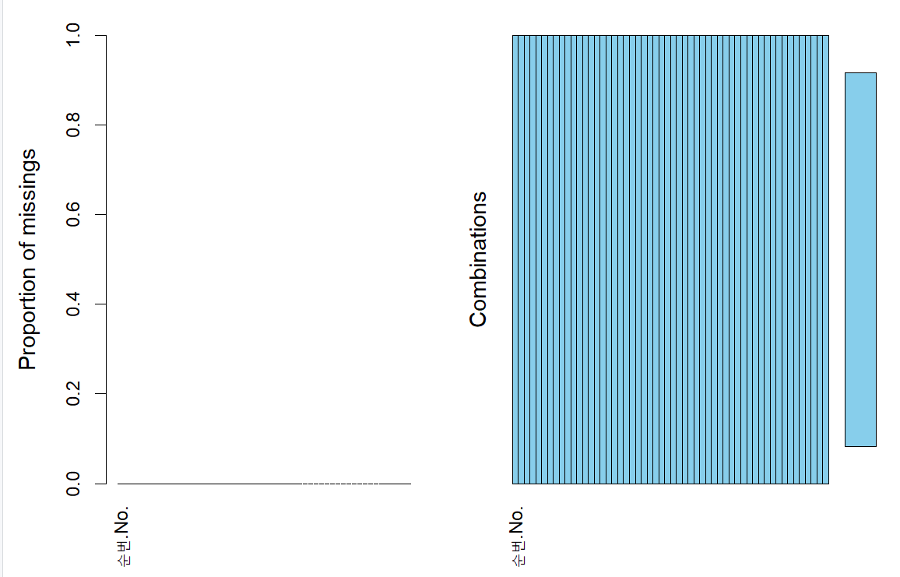

# 프로젝트 설정 및 실행 과정

## 0. 프로젝트 초기 설정

### 0.1 환경 준비
```r
# R 버전 확인
getRversion()

# renv 초기화
renv::init()

# renv 설정 동의
renv::consent(provided = TRUE)
```

### 0.2 패키지 설치
```r
# 필요한 패키지 목록
packages <- c(
  "tidyverse", "survival", "survminer", "flexsurv", "randomForest",
  "ranger", "xgboost", "mlr3", "tidymodels", "DALEX", "iml", "survex",
  "shiny", "shinydashboard", "DT", "plotly", "VIM", "mice", "httr",
  "jsonlite", "readxl", "janitor", "rms", "h2o"
)

# 패키지 설치
for (pkg in packages) {
  if (!requireNamespace(pkg, quietly = TRUE)) {
    install.packages(pkg)
  }
}
```

### 0.3 의존성 관리
```r
# 의존성 저장
renv::snapshot()

# 상태 확인
renv::status()
```

## 1. 데이터 처리 과정

### 1.1 데이터 로드
```r
# 데이터 로드
train_data <- read_csv("pre_process/암임상_라이브러리_합성데이터_train.csv", 
                       locale = locale(encoding = "UTF-8 with BOM"))

test_data <- read_csv("pre_process/암임상_라이브러리_합성데이터_test.csv", 
                      locale = locale(encoding = "UTF-8 with BOM"))
```

### 1.2 데이터 검증
```r
# 데이터 구조 확인
str(train_data)

# 결측치 확인
sum(is.na(train_data))

# 변수 타입 확인
sapply(train_data, class)
```

```shell
> # 결측치 확인
> print("\nTrain 데이터 결측치:")
[1] "\nTrain 데이터 결측치:"
> sum(is.na(train_data))
[1] 0
> print("\nTest 데이터 결측치:")
[1] "\nTest 데이터 결측치:"
> sum(is.na(test_data))
[1] 0
```
- 이미 결측치가 없음, 잘 처리된 데이터임

## 2. 탐색적 데이터 분석
### 2.1 기본 통계량 
```R
# 필요한 패키지 로드
library(tidyverse)
library(VIM)
library(survival)

# 데이터 로드
train_data <- read.csv("pre_process/암임상_라이브러리_합성데이터_train.csv")

# 1. 기본 통계량
print("\n기본 통계량:")
summary(train_data)

```

```
   순번.No.    진단시연령.AGE. 조직학적진단명.코드.설명.mucinous.
 Min.   :   0   Min.   :15.0    Min.   :0.000                     
 1st Qu.:2500   1st Qu.:45.0    1st Qu.:0.000                     
 Median :5000   Median :59.0    Median :0.000                     
 Mean   :5000   Mean   :58.1    Mean   :0.142                     
 3rd Qu.:7499   3rd Qu.:72.0    3rd Qu.:0.000                     
 Max.   :9999   Max.   :91.0    Max.   :1.000                     
 조직학적진단명.코드.설명.signet.ring.cell. 조직학적진단명.코드.설명.adenocarcinoma.
 Min.   :0.0000                             Min.   :0.0000                          
 1st Qu.:0.0000                             1st Qu.:1.0000                          
 Median :0.0000                             Median :1.0000                          
 Mean   :0.1363                             Mean   :0.8382                          
 3rd Qu.:0.0000                             3rd Qu.:1.0000                          
 Max.   :1.0000                             Max.   :1.0000                          
 조직학적진단명.코드.설명.carcinoide.tumor. 조직학적진단명.코드.설명.Neuroendocrine.carcinoma.
 Min.   :0.0000                             Min.   :0.0000                                    
 1st Qu.:0.0000                             1st Qu.:0.0000                                    
 Median :0.0000                             Median :0.0000                                    
 Mean   :0.1281                             Mean   :0.1327                                    
 3rd Qu.:0.0000                             3rd Qu.:0.0000                                    
 Max.   :1.0000                             Max.   :1.0000                                    
 조직학적진단명.코드.설명.squamous.cell.carcinoma. 조직학적진단명.코드.설명.Neoplasm.malignant.
 Min.   :0.0000                                    Min.   :0.0000                              
 1st Qu.:0.0000                                    1st Qu.:0.0000                              
 Median :0.0000                                    Median :0.0000                              
 Mean   :0.1331                                    Mean   :0.1341                              
 3rd Qu.:0.0000                                    3rd Qu.:0.0000                              
 Max.   :1.0000                                    Max.   :1.0000                              
 병기STAGE.Tis.   병기STAGE.T1.    병기STAGE.T1a.   병기STAGE.T1b.   병기STAGE.T1c.   병기STAGE.T2.   
 Min.   :0.0000   Min.   :0.0000   Min.   :0.0000   Min.   :0.0000   Min.   :0.0000   Min.   :0.0000  
 1st Qu.:0.0000   1st Qu.:0.0000   1st Qu.:0.0000   1st Qu.:0.0000   1st Qu.:0.0000   1st Qu.:0.0000  
 Median :0.0000   Median :0.0000   Median :0.0000   Median :0.0000   Median :0.0000   Median :0.0000  
 Mean   :0.1458   Mean   :0.1516   Mean   :0.1022   Mean   :0.0924   Mean   :0.0801   Mean   :0.1319  
 3rd Qu.:0.0000   3rd Qu.:0.0000   3rd Qu.:0.0000   3rd Qu.:0.0000   3rd Qu.:0.0000   3rd Qu.:0.0000  
 Max.   :1.0000   Max.   :1.0000   Max.   :1.0000   Max.   :1.0000   Max.   :1.0000   Max.   :1.0000  
 병기STAGE.T2a.   병기STAGE.T2b.   병기STAGE.T2C.   병기STAGE.T3.    병기STAGE.T3a.  병기STAGE.T3b.  
 Min.   :0.0000   Min.   :0.0000   Min.   :0.0000   Min.   :0.0000   Min.   :0.000   Min.   :0.0000  
 1st Qu.:0.0000   1st Qu.:0.0000   1st Qu.:0.0000   1st Qu.:0.0000   1st Qu.:0.000   1st Qu.:0.0000  
 Median :0.0000   Median :0.0000   Median :0.0000   Median :0.0000   Median :0.000   Median :0.0000  
 Mean   :0.0881   Mean   :0.0807   Mean   :0.0924   Mean   :0.0804   Mean   :0.082   Mean   :0.1026  
 3rd Qu.:0.0000   3rd Qu.:0.0000   3rd Qu.:0.0000   3rd Qu.:0.0000   3rd Qu.:0.000   3rd Qu.:0.0000  
 Max.   :1.0000   Max.   :1.0000   Max.   :1.0000   Max.   :1.0000   Max.   :1.000   Max.   :1.0000  
 병기STAGE.T4.    병기STAGE.T4a.   병기STAGE.T4b.   병기STAGE.N1.    병기STAGE.N1a.   병기STAGE.N1b.  
 Min.   :0.0000   Min.   :0.0000   Min.   :0.0000   Min.   :0.0000   Min.   :0.0000   Min.   :0.0000  
 1st Qu.:0.0000   1st Qu.:0.0000   1st Qu.:0.0000   1st Qu.:0.0000   1st Qu.:0.0000   1st Qu.:0.0000  
 Median :0.0000   Median :0.0000   Median :0.0000   Median :0.0000   Median :0.0000   Median :0.0000  
 Mean   :0.0819   Mean   :0.0395   Mean   :0.0379   Mean   :0.1526   Mean   :0.1175   Mean   :0.1116  
 3rd Qu.:0.0000   3rd Qu.:0.0000   3rd Qu.:0.0000   3rd Qu.:0.0000   3rd Qu.:0.0000   3rd Qu.:0.0000  
 Max.   :1.0000   Max.   :1.0000   Max.   :1.0000   Max.   :1.0000   Max.   :1.0000   Max.   :1.0000  
 병기STAGE.N1c.   병기STAGE.N2.    병기STAGE.N2a. 병기STAGE.N2b. 병기STAGE.N2c.   병기STAGE.N3.   
 Min.   :0.0000   Min.   :0.0000   Min.   :0      Min.   :0      Min.   :0.0000   Min.   :0.0000  
 1st Qu.:0.0000   1st Qu.:0.0000   1st Qu.:0      1st Qu.:0      1st Qu.:0.0000   1st Qu.:0.0000  
 Median :0.0000   Median :0.0000   Median :0      Median :0      Median :0.0000   Median :0.0000  
 Mean   :0.0816   Mean   :0.0691   Mean   :0      Mean   :0      Mean   :0.0686   Mean   :0.0486  
 3rd Qu.:0.0000   3rd Qu.:0.0000   3rd Qu.:0      3rd Qu.:0      3rd Qu.:0.0000   3rd Qu.:0.0000  
 Max.   :1.0000   Max.   :1.0000   Max.   :0      Max.   :0      Max.   :1.0000   Max.   :1.0000  
 병기STAGE.N3a. 병기STAGE.N3b. 병기STAGE.M1.    병기STAGE.M1a.   병기STAGE.M1b.   병기STAGE.M1c. 
 Min.   :0      Min.   :0      Min.   :0.0000   Min.   :0.0000   Min.   :0.0000   Min.   :0.000  
 1st Qu.:0      1st Qu.:0      1st Qu.:0.0000   1st Qu.:0.0000   1st Qu.:0.0000   1st Qu.:0.000  
 Median :0      Median :0      Median :0.0000   Median :0.0000   Median :0.0000   Median :0.000  
 Mean   :0      Mean   :0      Mean   :0.1716   Mean   :0.1187   Mean   :0.0996   Mean   :0.101  
 3rd Qu.:0      3rd Qu.:0      3rd Qu.:0.0000   3rd Qu.:0.0000   3rd Qu.:0.0000   3rd Qu.:0.000  
 Max.   :0      Max.   :0      Max.   :1.0000   Max.   :1.0000   Max.   :1.0000   Max.   :1.000  
 음주종류.Type.of.Drink. 흡연여부.Smoke.  신장값.Height.  체중측정값.Weight. 면역병리EGFR검사코드.명.EGFR.
 Min.   : 1.00           Min.   :0.0000   Min.   :132.4   Min.   : 33.00     Min.   : 1.00                
 1st Qu.: 2.00           1st Qu.:0.0000   1st Qu.:152.5   1st Qu.: 54.00     1st Qu.:99.00                
 Median :99.00           Median :0.0000   Median :162.1   Median : 63.90     Median :99.00                
 Mean   :62.58           Mean   :0.3987   Mean   :161.6   Mean   : 64.27     Mean   :76.35                
 3rd Qu.:99.00           3rd Qu.:1.0000   3rd Qu.:170.3   3rd Qu.: 74.10     3rd Qu.:99.00                
 Max.   :99.00           Max.   :2.0000   Max.   :187.0   Max.   :113.00     Max.   :99.00                
 분자병리MSI검사결과코드.명.MSI. 분자병리KRASMUTATION_EXON2검사결과코드.명.KRASMUTATION_EXON2.
 Min.   : 1.00                   Min.   : 1.00                                                
 1st Qu.: 3.00                   1st Qu.: 2.00                                                
 Median :99.00                   Median :99.00                                                
 Mean   :66.16                   Mean   :74.04                                                
 3rd Qu.:99.00                   3rd Qu.:99.00                                                
 Max.   :99.00                   Max.   :99.00                                                
 분자병리KRASMUTATION검사결과코드.명.KRASMUTATION. 분자병리NRASMUTATION검사결과코드.명.NRASMUTATION.
 Min.   : 1.0                                      Min.   : 1.00                                    
 1st Qu.:99.0                                      1st Qu.:99.00                                    
 Median :99.0                                      Median :99.00                                    
 Mean   :78.3                                      Mean   :74.98                                    
 3rd Qu.:99.0                                      3rd Qu.:99.00                                    
 Max.   :99.0                                      Max.   :99.00                                    
 분자병리BRAF_MUTATION검사결과코드.명.BRAF_MUTATION. 대장암.수술.여부.Operation.
 Min.   : 1.00                                       Min.   :0.0000             
 1st Qu.:99.00                                       1st Qu.:1.0000             
 Median :99.00                                       Median :1.0000             
 Mean   :76.87                                       Mean   :0.7538             
 3rd Qu.:99.00                                       3rd Qu.:1.0000             
 Max.   :99.00                                       Max.   :1.0000             
 항암제.치료.여부.Chemotherapy. 방사선치료.여부.Radiation.Therapy. 사망여부.Death. 
 Min.   :0.0000                 Min.   :0.0000                     Min.   :0.0000  
 1st Qu.:0.0000                 1st Qu.:0.0000                     1st Qu.:0.0000  
 Median :0.0000                 Median :0.0000                     Median :0.0000  
 Mean   :0.1483                 Mean   :0.1411                     Mean   :0.1795  
 3rd Qu.:0.0000                 3rd Qu.:0.0000                     3rd Qu.:0.0000  
 Max.   :1.0000                 Max.   :1.0000                     Max.   :1.0000  
 암진단후생존일수.Survival.period.
 Min.   :  16.0                   
 1st Qu.: 162.0                   
 Median : 409.0                   
 Mean   : 551.3                   
 3rd Qu.: 827.0                   
 Max.   :1825.0        

- 조직학적 아형: adenocarcinoma가 가장 많음(평균 0.8382), mucinous(0.142), signet ring cell(0.1363) 등은 소수
- 병기: 대부분의 병기 변수는 평균이 0.1~0.17 수준으로, 각 병기에 해당하는 환자 비율을 의미
- 치료: 수술 시행률이 높음(평균 0.7538), 항암제 및 방사선 치료는 상대적으로 낮음(각각 0.1483, 0.1411)
- 사망률: 평균 0.1795로, 전체 환자의 약 18%가 사망
- 생존기간: 중앙값 409일, 평균 551.3일, 최대 1825일(5년)

```
### 2.2 결측치 분석
```R
# 결측치 시각화
VIM::aggr(train_data, plot = TRUE)
```

- 앞에서 확인했듯이 결측치는 0이다.
- 왼쪽 그래프가 비어있음, 0으로 표시된다는 것


## 3. 모델 개발 과정

### 3.1 생존분석 모델
```r
# 생존 객체 생성
surv_obj <- Surv(time = train_data$`Survival period`, 
                 event = train_data$Death)

# Cox 모델
cox_model <- coxph(surv_obj ~ ., data = train_data)

# 모델 저장
saveRDS(cox_model, "models/cox_model.rds")
```

### 3.2 ML 모델
```r
# Random Forest
rf_model <- randomForest(
  Surv(time = `Survival period`, status = Death) ~ .,
  data = train_data
)

# 모델 저장
saveRDS(rf_model, "models/rf_model.rds")
```

## 4. Shiny 애플리케이션 실행

### 4.1 앱 실행
```r
# Shiny 앱 실행
shiny::runApp("R/shiny_app")
```

### 4.2 LLM 통합
```r
# ollama 설정
system("ollama run llama2:7b-chat")
```

## 5. 문제 해결 가이드

### 5.1 renv 관련 문제
```r
# renv 초기화
renv::init()

# 의존성 복원
renv::restore()

# 상태 확인
renv::status()
```

### 5.2 데이터 로드 문제
```r
# 인코딩 확인
read_csv("pre_process/암임상_라이브러리_합성데이터_train.csv", 
         locale = locale(encoding = "UTF-8 with BOM"))
```

### 5.3 모델 저장 문제
```r
# 디렉토리 확인
dir.exists("models")

# 디렉토리 생성
dir.create("models", recursive = TRUE)
```

## 6. 참고사항

### 6.1 패키지 버전 확인
```r
# 설치된 패키지 버전 확인
packageVersion("survival")
packageVersion("shiny")
```

### 6.2 R 세션 정보
```r
# R 세션 정보
sessionInfo()
```

### 6.3 디렉토리 구조
```
암환자_생존율예측/
├── R/
│   ├── 01_data_preparation.R
│   ├── 02_exploratory_analysis.R
│   ├── 03_survival_modeling.R
│   ├── 04_ml_models.R
│   ├── 05_model_evaluation.R
│   └── shiny_app/
├── pre_process/
├── data/
├── models/
├── plots/
└── renv/
```

---

**주의사항**:
- 모든 코드 실행 전 해당 디렉토리가 있는지 확인하세요
- 데이터 로드 시 인코딩을 명시적으로 지정하세요
- 모델 저장 전 저장 디렉토리가 있는지 확인하세요
- renv 관련 작업은 프로젝트 디렉토리에서 실행하세요
